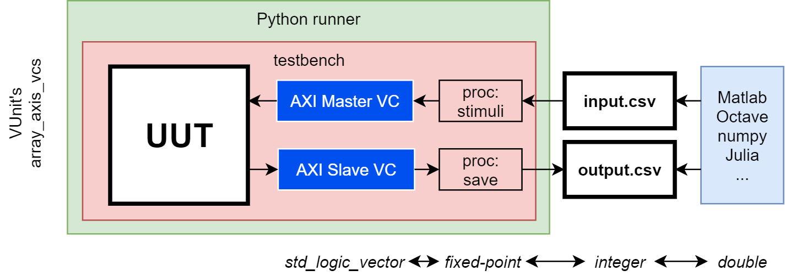
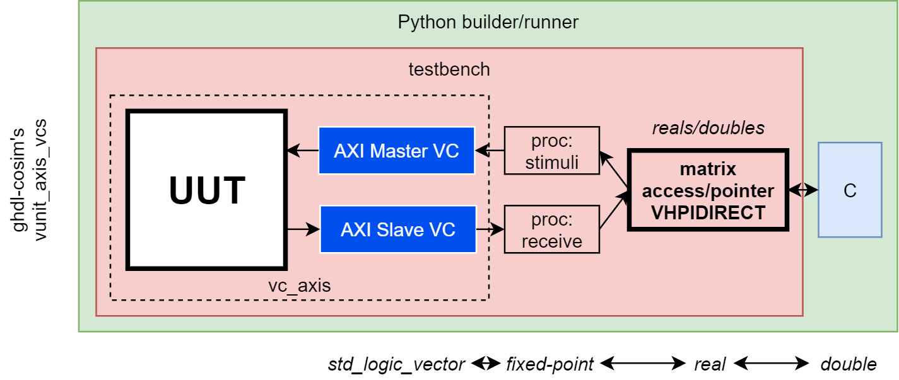

.. program:: ghdl
.. _COSIM:VHPIDIRECT:Examples:arrays:

Arrays
#######

.. IMPORTANT::
  A VHDL access that is used for a constrained/bounded array is tied to a type that specifies its length. In
  :ref:`COSIM:VHPIDIRECT:Examples:arrays:intvector` and :ref:`COSIM:VHPIDIRECT:Examples:arrays:matrices` below, one and
  two dimensional lengths are specified, respectively.
  This means that a separate type needs to be declared for an array with different dimensions and/or different sizes in
  any dimension. In order to create a single type for many differently shaped arrays, it would need to be unconstrained.
  See :cosimsharp:`3` for work in progress regarding unconstrained types.

.. _COSIM:VHPIDIRECT:Examples:arrays:intvector:

Constrained/bounded integer arrays
**********************************

As explained in :ref:`Restrictions_on_foreign_declarations`, unconstrained arrays are represented by a fat pointer in C,
and it is not suggested to use fat pointers unless it is unavoidable. Hence, it is desirable for data buffers which are
to be represented as arrays to be constrained. However, constraining arrays in VHDL and C separately is error prone.

This example includes multiple solutions to set the bounding size once only (either in C or in VHDL), and have the
parameter passed to the other language so that matching types are defined. Moreover, independently of where the size is
defined, it is possible to allocate and free the buffers in any of the languages. The following examples show how to
define them in C or VHDL and have them (de)allocated in either of them.

.. ATTENTION::
  Pointers/accesses MUST be freed/deallocated in the same language that was used to allocate them. Hence, it is not
  possible to allocate in VHDL and free in C, nor *vice versa*.

.. _COSIM:VHPIDIRECT:Examples:arrays:intvector:csized:

:cosimtree:`Sized in C <vhpidirect/arrays/intvector/csized>`
------------------------------------------------------------

Integer arrays fully defined in C can be passed to VHDL by first passing their size, so that an appropriate array
type can be created in VHDL to hold the array's access (pointer). After that, another VHPIDIRECT subprogram can be
defined to return the array access.

This example shows how to hardcode both the length and the initial content of an array in C. Matching types are created in
VHDL, the pointer is passed and the content is read and modified from VHDL.

If the integer array must be created or filled at runtime by some more advanced process, it is possible to execute the GHDL
simulation within a custom ``main()`` entrypoint (see :ref:`COSIM:VHPIDIRECT:Examples:quickstart:wrapping:basic`). This use
case is included in the example too. By using ``main.c`` instead of ``caux.c``, the content of the array is written
programatically in C, before calling ``ghdl_main``. Note that the content of the array is read from C both before and after
executing the simulation.

.. NOTE::
  There is no explicit example about how to have the size defined in C, but have the allocation/deallocation performed
  in VHDL. However, implementing such a solution is a matter of combining these examples with the VHDL-sized ones below.

:cosimtree:`Sized in VHDL <vhpidirect/arrays/intvector/vhdlsized>`
------------------------------------------------------------------

Complementing the examples above, when the size of a bounded/constrained array is defined in VHDL, it is possible to have
the (de)allocation performed in either VHDL or C. However, while accesses to constrained VHDL types do contain metada about
the bounds, pointers in C do not. Hence, in these examples, the length is explicitly passed along with the pointer/access.
Note that other possible implementations would save the length in a variable in C, so that it does not need to be passed
each time. This is done in the example with ``main()`` above.

In this example two equivalent architectures are provided. In ``calloc`` allocation and deallocation is done in C, invoked
from VHDL. Conversely, in ``vhdlalloc`` the allocation and deallocation is done in VHDL. Apart from that, both are
functionally equivalent:

* A constrained array is allocated.
* The content is initialized from C.
* The content is read and modified from VHDL.
* A function in C is used to assert the modifications and to print the results.
* The array is deallocated.

Note that VHPIDIRECT resources are defined in a package (as shown in :ref:`COSIM:VHPIDIRECT:Examples:quickstart:package`).
The same package and the corresponding C source file (``caux.c``) are used in both examples, even though ``vhdlalloc`` does
not need neither ``[c_]allocIntArr`` nor ``[c_]freePointer``.

.. _COSIM:VHPIDIRECT:Examples:arrays:logicvectors:

:cosimtree:`Vector of std_logic <vhpidirect/arrays/logicvector>`
****************************************************************

Commonly signals in VHDL are of a logic type or a vector thereof (``std_logic`` and ``std_logic_vector``), coming from IEEE's ``std_logic_1164`` package.
These types can hold values other than high and low (``1`` and ``0``) and are enumerated as:

0. 'U'
1. 'X'
2. '0'
3. '1'
4. 'Z'
5. 'W'
6. 'L'
7. 'H'
8. '-'

As mentioned in :ref:`Restrictions_on_foreign_declarations`:

	- Because the number of enumeration values is less than 256, logic values are transported in 8 bit words (a ``char`` type in C).

		- In this example two declarations make handling logic values in C a bit easier:

			- Providing logic values in C as their enumeration numbers is simplified with the use of a matching enumeration, ``HDL_LOGIC_STATES``.
			- Printing out a logic value's associated character is also simplified with the ``const char HDL_LOGIC_CHAR[]`` declaration.

	- Logic vectors, of a bounded size, can be easily created in C as a ``char[]`` and passed to VHDL to be read as an ``access`` type in VHDL, in this case an access of a subtype of std_logic_vector.

This example builds on the integer vector example (:ref:`COSIM:VHPIDIRECT:Examples:arrays:intvector`), by instead passing an array of logic values. Foreign subprograms are declared that enable receiving the size of two different logic vectors as well as the vectors themselves from C. There is only one subprogram to get the size of both C arrays, and it takes in an integer to determine which array's size gets returned.

.. HINT::
  The ``getLogicVecSize`` in VHDL is declared as receiving a ``boolean`` argument. In C the function is declared to receive an ``char`` argument. The VHDL booleans ``false`` and ``true`` are enumerations, and have integer values, ``0`` and ``1`` respectively. As with the logic values, the boolean enumerations use fewer than 8 bits, so the single byte in C's ``char`` variable receives the VHDL enumeration correctly.

For illustrative purposes, the two vectors are populated with logic values in different ways:

- LogicVectorA's indices are manually filled with enumeration values from HDL_LOGIC_STATES.

  - .. code-block:: C

        logic_vec_A[0] = HDL_U;

- LogicVectorB's indices are filled with an integer value.

  - .. code-block:: C

        for(int i = 0; i < SIZE_LOGIC_VEC_B; i++){
          logic_vec_B[i] = 8-i;
        }

.. ATTENTION::
  The integer values that are given to ``char`` variables in C which are intended to be read as VHDL logic values, must be limited to [0, 8]. This ensures that they represent one of the 9 enumerated logic values.
.. _COSIM:VHPIDIRECT:Examples:arrays:matrices:

:cosimtree:`Matrices <vhpidirect/arrays/matrices>`
**************************************************

Constrained multidimensional arrays of doubles/reals
----------------------------------------------------

In many signal and image processing applications, large amounts of data need to be transferred between software and
hardware. In software, it is common to use floating-point data types, since most general-purpose processors include
hard floating-point units. Conversely, fixed-point formats are used in hardware, in order to optimise area and power.
Converting data formats and using intermediate files to transfer test data to/from a simulation model can be tedious
and error-prone.

This example builds on :ref:`intvector <COSIM:VHPIDIRECT:Examples:arrays:intvector>`. Precisely, it's an extension of
case :ref:`COSIM:VHPIDIRECT:Examples:arrays:intvector:csized`. A general procedure to share constrained multidimensional
arrays of any size is shown. Dimensions of a 2D matrix of doubles are defined in C and a helper function is used for
VHDL to read those values into the declaration of an *array of reals* type. Then, the pointer to the matrix (in C) is
retrieved as an access (in VHDL), through another helper function.

For completeness, IEEE's ``fixed_generic_pkg`` package is used to multiply each value with a constant using fixed-point
formats. This is to illustrate that VHDL 2008 can be used as *fixed-point toolbox* in numerical processing environments.

:cosimtree:`Array and AXI4 Stream Verification Components <vhpidirect/arrays/matrices/vunit_axis_vcs>`
------------------------------------------------------------------------------------------------------

.. HINT::
  This example is based on `VUnit <http://vunit.github.io/>`_, an open source unit testing framework for VHDL/SystemVerilog.
  Instead of a shell script, the main entrypoint to this example is a ``run.py`` Python script. Users who are not familiar
  with VUnit are encouraged to first read :ref:`vunit:user_guide` and get familiar with VUnit example `array_axis_vcs <http://vunit.github.io/examples.html#id9>`_.

`VUnit <http://vunit.github.io/>`_ provides an :ref:`integer_array <vunit:integer_array_pkg>` package with ``load_csv``
and ``save_csv`` functions. Those are used in `Array and AXI4 Stream Verification Components <http://vunit.github.io/examples.html#id9>`_,
along with AXI4 Stream components from the :ref:`vunit:vc_library`, to load data from CSV files to a UUT. While CSVs as
intermediate files are useful for integration with Matlab, Octave, NumPy, etc., not having an equivalent `real_array`
package posses an additional complexity in applications such as DSP or machine learning. This is because values to be
handled in fixed-point need to be first converted from doubles to integers.

Subdir :cosimtree:`vunit_axis_vcs <vhpidirect/arrays/matrices/vunit_axis_vcs>` of this example contains a modified
version of a VUnit example (`array_axis_vcs <http://vunit.github.io/examples.html#id9>`_), where ``integer_array``
and CSV files are replaced with VHPIDIRECT functions, so that data is read from C directly. In fact, no additional
co-simulation sources are included in the subdir because the ``main.c`` and ``pkg.vhd`` from the parent dir are used.
These will share the matrix as in the parent example, which is then passed to/from the verification components to test
the AXI Stream master/slave setup. The top-level processes ``stimuli`` and ``receive`` are the master sending and the
slave receiving, respectively, data from/to the matrix variable. For completeness only, ``stimuli`` verifies the contents
of the matrix before sending it, row by row.

This example illustrates how to separate sources for synthesis from testbench/simulation resources, enhanced with GHDL's
co-simulation features and with VUnit's verification components. At the same time, this is a showcase of how to combine
a VUnit ``run.py`` script (for building and test management) along with custom VHPIDIRECT resources.

.. HINT::
  Combining VUnit's verification components with VHPIDIRECT allows to build simulation models for VHDL designs
  with complex top-level interfaces, while providing a C API to interact with them. Find work in progress in this regard
  at `VUnit/cosim <https://vunit.github.io/cosim/>`_.
